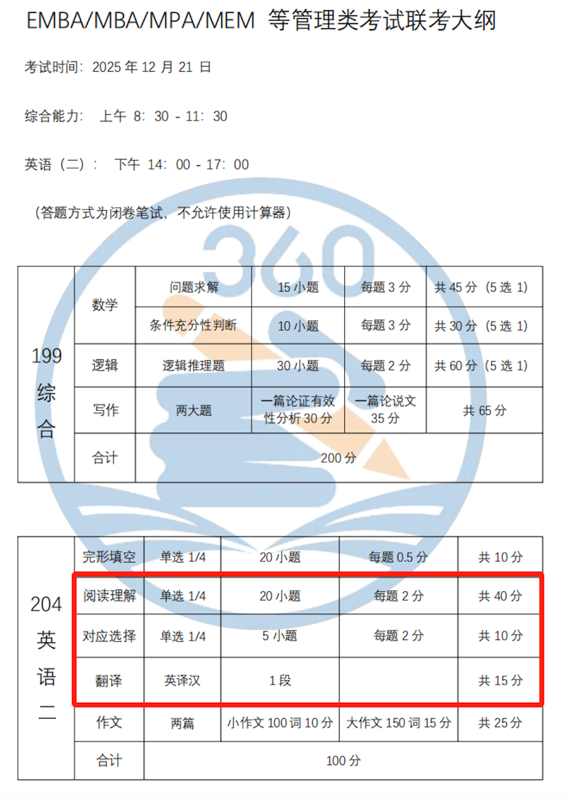
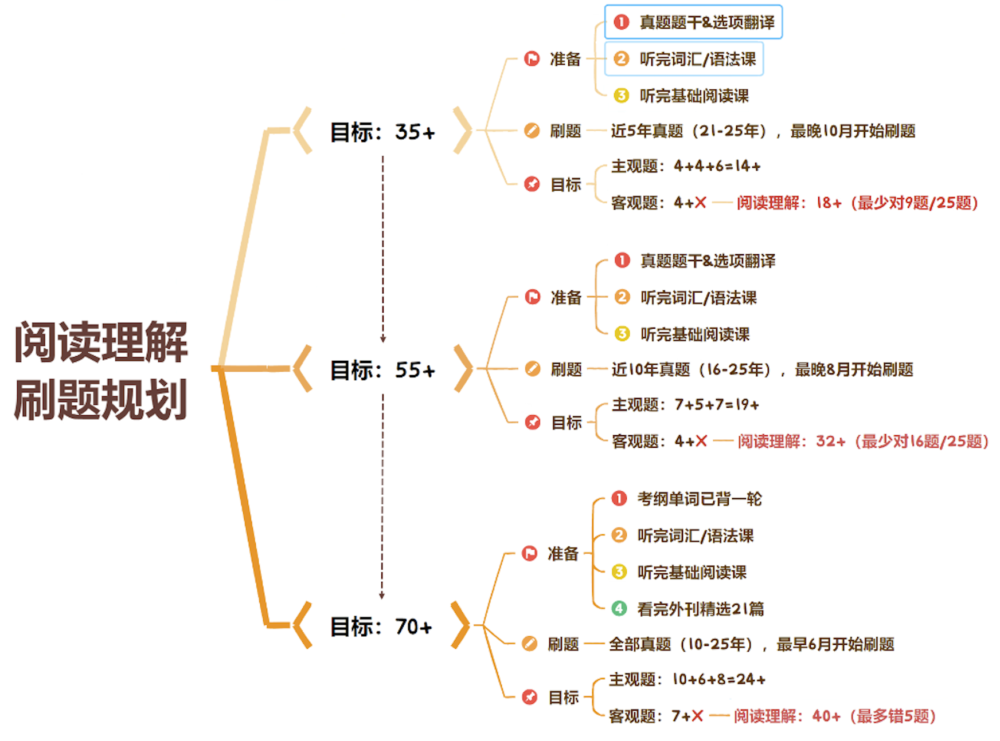

# 介绍

数学1小时
逻辑1小时
写作还不知道
英语还不知道


目标: 
数50
逻辑 40
英语 40
写作 50


```
1. 数学部分（共25题，75分）
问题求解（15题）：每题3分，共45分

题型：选择题（五选一），考查算术、代数、几何、数据分析等。

条件充分性判断（10题）：每题3分，共30分

题型：特殊题型（判断条件是否充分支持结论），需熟悉解题规则。

总分：75分
建议时间：60-65分钟（平均每题2-2.5分钟）

2. 逻辑部分（共30题，60分）
形式逻辑：约5-8题

考查推理规则（如假言命题、直言命题）。

论证逻辑：约10-12题

考查削弱、支持、假设、解释等题型。

综合推理：约10-12题

考查信息整合、排序、匹配等（近年占比增加，耗时较长）。

总分：60分
建议时间：50-55分钟（平均每题1.5-2分钟）

总结
数学：25题（15问题求解 + 10条件充分性判断），75分。

逻辑：30题（形式+论证+综合推理），60分。

写作：2篇（65分），不计入题目数，但需预留55-60分钟。

总题量：55道选择题 + 2篇写作，时间非常紧张，需严格按策略分配！
```




