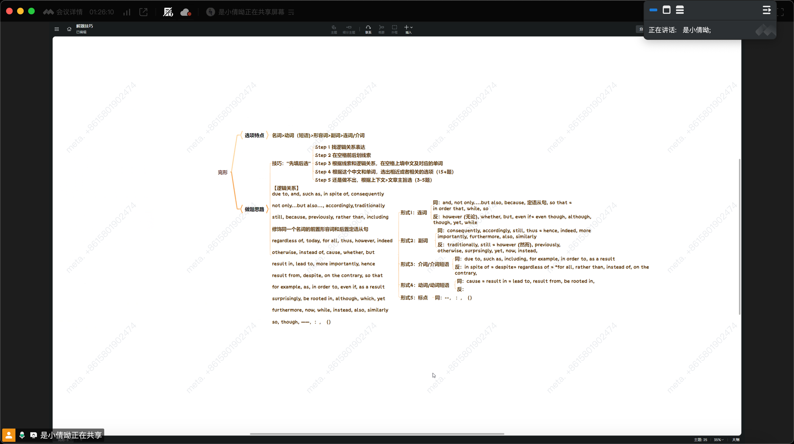

# 翻译

Technical and data skills that have been highly sought after for decades appear to be among 
the most exposed to advances in artificial intelligence. But other skills, particularly the people skills 
that we have long undervalued as soft, will very likely remain the most durable. That is a hopeful 
sign that A.I. could usher in a world of work that is anchored more, not less, around human ability

be anchored in = be base on / depend on

LinkedIn researchers recently looked at which skills `any given job requires` and then identified 
over 500 likely to be affected by generative A.I. technologies. They then estimated that 96 percent 
of a software engineer's current skills — mainly proficiency in programming languages — can 
eventually be replicated by A.I. In fact, given the broad impact A.I. is set to have, it is quite likely 
to affect all of our work ` to some degree or another`

given = prep , 介于, 由于

We believe there will be engineers in the future, but they will most likely spend less time coding 
and more time on tasks like collaboration and communication.

A recent Jobs for the Future survey found that 78 percent of the 10 top-employing occupations 
classified uniquely human skills and tasks `as "important" or "very important."` These are skills like 
building interpersonal relationships, negotiating between parties and guiding and motivating teams.

Now is the time for leaders, across sectors, to develop new ways for students to learn that are 
more directly, and more dynamically, tied to where our economy is going, not where it has been. 
Critically, that involves bringing the same level of rigor to training around people skills that we have 
brought to technical skills.

---

1. “Reskilling” is something that sounds like a buzzword but is actually a requirement if we plan to 
have a future where a lot of would-be workers do not get left behind.

2.  When the skills mismatch is in the broader economy though, the focus usually turns to government 
to handle.

3.   As of May, those rates had spiked up to 13.3 per cent and 
13.7 per cent, and although many worker shortages had disappeared, not all had done so.

4. But even if you cannot close that gap, maybe you can close 
others, and doing so would be to the benefit of all concerned.

1. B

2. A

定为句前一句
For individual companies, the 
temptation is always to let go of workers whose skills are no longer in demand and replace them 
with those whose skills are. , 还不行就段首, 再不行看主旨, 这个题目是 都不行,最后看主旨

3. D

Efforts in Canada and elsewhere have been arguably languid at best, and have given us a 
situation where we frequently hear of employers begging for workers, even at times and in regions 
where unemployment is high ??

4. C

5. B

adj. 失业的 unemployed
adj. 高要求的 demaining

adj. 引起广泛争议的 constroersial
v. 改变 alter
n. 性格  character
n. 决议 resolution
反对 oppose
调整。adjust
不切实际的。impractical

1. C
It is true that CEO pay has gone up—top ones may make 300 times the pay of typical workers 
on average, and since the mid-1970s CEO pay for large publicly traded American corporations has, 
by varying estimates, gone up by about 500%.

2. D
CEOs must have a good sense of financial markets and maybe 
even how the company should trade in them. They also need better public relations skills than their 
predecessors, as the costs of even a minor slipup can be significant.

3. B
The common idea that high CEO pay is mainly about ripping people off doesn’t explain history 
very well. By most measures, corporate governance has become a lot tighter and more rigorous 
since the 1970s. Yet it is principally during this period of stronger governance that CEO pay has 
been high and rising. 

4. D

5. A 

n. 贡献 contribution
adj. 公司的 corporate
v. 确保 confirm
adj. 实惠的 economical
n. 机构 establishment
v. 保护，节约 conserve
n. 正义，大法官 justice

contribute to 导致, 撰稿, 定期缴纳
firmly believe 坚定相信
major in Economic 主修经济学

Forstera sense of belongging 培养一种经济学
 

国家的意思: power, economies

1. C

 Children aren’t born knowing 
how to say “I’m sorry”; rather, they learn over time that such statements appease parents and friends 
– and their own consciences. This is why researchers generally regard so-called moral guilt, in the 
right amount, to be a good thing.

2. B
In the popular imagination, of course, guilt still gets a bad rap. It is deeply uncomfortable – it’s 
the emotional equivalent of wearing a jacket weighted with stones.

3. D
“There has been a kind of revival or a rethinking about what guilt is and what role guilt 
can serve,” says Amrisha Vaish, a psychology researcher at the University of Virginia, adding that 
this revival is part of a larger recognition that emotions aren’t binary – feelings that may be 
advantageous in one context may be harmful in another. 

4. B
In a number 
of studies, Malti and others have shown that guilt and sympathy may represent different pathways 
to cooperation and sharing.

5. D
Using caregiver assessments and 
the children’s self-observations, she rated each child’s overall sympathy level and his or her 
tendency to feel negative emotions after moral transgressions

重要派生词
adj. 内疚的 guilty
n. 规则 regulation
adj. 多愁善感的  emotional
n. 情报 intelligence
adj. 聪明的 intelligent
adj. 剧烈的，intense  (pain, competition)
adj. 强化的 intensive (course)
v. 欺骗 __________
n. 对…上瘾的人 __________
adj. 有益的  beneficial
v. 同情 __________
n. 冲动 __________

3. 必记搭配
a sense of guilt
deny his guilt
feel guilty about
regulate their body heat
stick to the regulation
mixed emotion
emotional problem
intellectual property
intelligence agencies
intensive course
intense pain
deceive sb into doing 
deceptive practices
game addict
be addicted to 
express sympathy for
sympathize with
impulse shopping
on impulse 
impulse shopping
an impulsive decision

1. B
 “Tech is designed to really suck you in,” says Jenny Radesky in her study of digital play, 
“and digital products are there to promote maximal engagement.

2. D
Radesky has studied the use of mobile phones and tablets at mealtimes by giving mother-child 
pairs a food-testing exercise. She found that mothers who used devices during the exercise started 
20 per cent fewer verbal and 39 per cent fewer nonverbal interactions with their children.

3. D

Infants are wired to look at parents’ faces to try to understand their world, and if those faces 
are blank and unresponsive—as they often are when absorbed in a device—it can be extremely 
disconcerting for the children.

4. C

On the other hand, Tronick himself is concerned that the worries about kids’ use of screens are 
born out of an “oppressive ideology that demands that parents should always be interacting” with 
their children: “It’s based on a somewhat fantasized, very white, very upper-middle-class ideology 
that says if you’re failing to expose your child to 30,000 words you are neglecting them."

5. A

 Tronick 
believes that just because a child isn’t learning from the screen doesn’t mean there’s no value to it—
particularly if it gives parents time to have a shower, do housework or simply have a break from 
their child.

absorb 吸收
matter n.麻烦 v 重要的事情 
appetite 胃口
developerment 发展,研发 培养, 患病
distract 分散
Expression 表达,表情
insensitive 不明感的
respond 回应
exposure 暴露, 接触
constant 持续

 n about / with